# XamPreps Database Schema

## Overview

XamPreps uses **Firestore** (NoSQL document database) as its primary data store. The schema consists of 19 collections organized around users, exam content, student activity, social features, and monetization.

## Schema Diagram

```mermaid
erDiagram
    %% User Collections
    profiles {
        string id PK
        string email
        string name
        string avatar_url
        string level "PLE|UCE|UACE"
        string school
        string phone
        string dob
        string contact_person
        timestamp created_at
        timestamp updated_at
    }

    user_roles {
        string id PK
        string role "student|parent|school|admin"
        timestamp updated_at
    }

    user_progress {
        string id PK
        number xp
        number streak
        string last_exam_date
        boolean freeTrialUsed
        string freeTrialExamId
        timestamp updated_at
    }

    %% Exam Content Collections
    exams {
        string id PK
        string title
        string subject
        string level "PLE|UCE|UACE"
        number year
        string type "Past Paper|Practice Paper"
        string difficulty "Easy|Medium|Hard"
        number timeLimit
        boolean isFree
        string description
        string topic
        string explanationPdfUrl
        number questionCount
        timestamp created_at
        timestamp updated_at
    }

    questions {
        string id PK
        string examId
        number questionNumber
        string text
        string imageUrl
        timestamp created_at
        timestamp updated_at
    }

    question_parts {
        string id PK
        string questionId
        number orderIndex
        string text
        string answer
        string explanation
        number marks
        string answerType "text|numeric|open-ended"
        timestamp created_at
        timestamp updated_at
    }

    %% Student Activity Collections
    exam_attempts {
        string id PK
        string userId
        string examId
        string mode "practice|simulation|quiz"
        number score
        number totalQuestions
        number timeTaken
        timestamp completedAt
        timestamp created_at
        timestamp updated_at
    }

    question_history {
        string id PK "userId_questionPartId"
        string userId
        string questionPartId
        string examId
        boolean isCorrect
        number streak
        string nextReview
        string lastAttempt
        timestamp created_at
        timestamp updated_at
    }

    %% Social Collections
    forum_categories {
        string id PK
        string name
        string description
        string icon
        timestamp created_at
        timestamp updated_at
    }

    forum_posts {
        string id PK
        string title
        string content
        string authorId
        string categoryId
        boolean isPinned
        boolean isLocked
        string[] tags
        timestamp createdAt
        timestamp updatedAt
    }

    forum_replies {
        string id PK
        string postId
        string authorId
        string content
        timestamp createdAt
        timestamp updatedAt
    }

    notifications {
        string id PK
        string userId
        string text
        boolean read
        timestamp createdAt
        timestamp updated_at
    }

    %% Account Linking Collections
    link_codes {
        string id PK
        string code
        string creatorId
        string creatorType "parent|school"
        timestamp expiresAt
        string usedBy
        timestamp usedAt
        timestamp createdAt
        timestamp updatedAt
    }

    link_requests {
        string id PK
        string requesterId
        string targetId
        string[] participantIds
        string status "pending|accepted|rejected"
        string requesterRole
        string targetRole
        timestamp createdAt
        timestamp updatedAt
    }

    linked_accounts {
        string id PK "parentOrSchoolId_studentId"
        string parentOrSchoolId
        string studentId
        timestamp linkedAt
        timestamp createdAt
        timestamp updatedAt
    }

    %% Achievement Collections
    achievements {
        string id PK
        string name
        string description
        string icon
        number xpReward
    }

    user_achievements {
        string id PK
        string userId
        string achievementId
        timestamp earnedAt
    }

    %% Monetization Collections
    subscriptions {
        string id PK
        string userId
        string plan "Standard|Premium"
        timestamp expiresAt
        timestamp createdAt
    }

    paper_purchases {
        string id PK
        string userId
        string examId
        number amount
        string monthYear
        timestamp createdAt
    }

    %% Relationships
    exams ||--o{ questions : "contains"
    questions ||--o{ question_parts : "has parts"
    profiles ||--|| user_roles : "has role"
    profiles ||--|| user_progress : "tracks progress"
    profiles ||--o{ exam_attempts : "makes attempts"
    profiles ||--o{ question_history : "has history"
    profiles ||--o{ user_achievements : "earns achievements"
    profiles ||--o{ linked_accounts : "links via"
    link_codes ||--o| linked_accounts : "redeemed for"
    forum_categories ||--o{ forum_posts : "contains"
    forum_posts ||--o{ forum_replies : "has replies"
    profiles ||--o{ forum_posts : "authors"
    profiles ||--o{ forum_replies : "authors"
    profiles ||--o{ notifications : "receives"
    exams ||--o{ exam_attempts : "attempted in"
    questions ||--o{ question_history : "tracked in"
```

## Collection Details

### User Collections

#### `profiles`

User profile information. Created during sign-up via `AuthContext.signUp()`.

| Field            | Type      | Description                    | Read By   | Written By                            |
| ---------------- | --------- | ------------------------------ | --------- | ------------------------------------- |
| `id`             | string    | User UID (document ID)         | All       | `AuthContext.signUp()`                |
| `email`          | string    | User email                     | All       | `AuthContext.signUp()`, user settings |
| `name`           | string    | Display name                   | All       | `AuthContext.signUp()`, user settings |
| `avatar_url`     | string    | Profile picture URL            | Dashboard | User settings                         |
| `level`          | string    | Education level (PLE/UCE/UACE) | Dashboard | User settings                         |
| `school`         | string    | School name                    | Profile   | User settings                         |
| `phone`          | string    | Phone number                   | Profile   | User settings                         |
| `dob`            | string    | Date of birth                  | Profile   | User settings                         |
| `contact_person` | string    | For school accounts            | Profile   | Admin                                 |
| `created_at`     | timestamp | Account creation               | Admin     | `AuthContext.signUp()`                |
| `updated_at`     | timestamp | Last update                    | -         | User settings                         |

#### `user_roles`

Role assignment for authorization. Created during sign-up.

| Field        | Type      | Description                            | Read By                                          | Written By             |
| ------------ | --------- | -------------------------------------- | ------------------------------------------------ | ---------------------- |
| `id`         | string    | User UID (document ID)                 | All                                              | `AuthContext.signUp()` |
| `role`       | string    | `student`, `parent`, `school`, `admin` | `AuthContext`, `ProtectedRoute`, Cloud Functions | `AuthContext.signUp()` |
| `updated_at` | timestamp | Last update                            | -                                                | Admin (future)         |

#### `user_progress`

Gamification and learning progress tracking. Created during sign-up, updated after each exam.

| Field             | Type      | Description                 | Read By              | Written By                            |
| ----------------- | --------- | --------------------------- | -------------------- | ------------------------------------- |
| `id`              | string    | User UID (document ID)      | All                  | `AuthContext.signUp()`                |
| `xp`              | number    | Total experience points     | Dashboards           | `submitExamAttempt` function          |
| `streak`          | number    | Current day streak          | Dashboards           | `submitExamAttempt` function          |
| `last_exam_date`  | string    | ISO date of last exam       | Streak calendar      | `submitExamAttempt` function          |
| `freeTrialUsed`   | boolean   | Whether free trial used     | `useExamAccess` hook | `useExamAccess.useFreeTrialForExam()` |
| `freeTrialExamId` | string    | Exam ID used for free trial | `useExamAccess` hook | `useExamAccess.useFreeTrialForExam()` |
| `updated_at`      | timestamp | Last update                 | -                    | Various                               |

### Exam Content Collections

#### `exams`

Exam metadata. Created and managed by admins.

| Field               | Type      | Description                      | Read By          | Written By                        |
| ------------------- | --------- | -------------------------------- | ---------------- | --------------------------------- |
| `id`                | string    | Exam UID (document ID)           | All              | `adminUpsertExam` function        |
| `title`             | string    | Exam title                       | All UI           | `adminUpsertExam` function        |
| `subject`           | string    | Subject name                     | All UI           | `adminUpsertExam` function        |
| `level`             | string    | `PLE`, `UCE`, `UACE`             | Filters, UI      | `adminUpsertExam` function        |
| `year`              | number    | Exam year                        | Sorting, UI      | `adminUpsertExam` function        |
| `type`              | string    | `Past Paper` or `Practice Paper` | Filters          | `adminUpsertExam` function        |
| `difficulty`        | string    | `Easy`, `Medium`, `Hard`         | Filters          | `adminUpsertExam` function        |
| `timeLimit`         | number    | Time limit in minutes            | Exam timer       | `adminUpsertExam` function        |
| `isFree`            | boolean   | Whether exam is free             | Access control   | `adminUpsertExam` function        |
| `description`       | string    | Exam description                 | Exam card        | `adminUpsertExam` function        |
| `topic`             | string    | Specific topic                   | Future filtering | `adminUpsertExam` function        |
| `explanationPdfUrl` | string    | URL to PDF explanations          | Future feature   | `adminUpsertExam` function        |
| `questionCount`     | number    | Number of questions              | Admin UI         | `adminSaveExamQuestions` function |
| `created_at`        | timestamp | Creation date                    | Admin            | `adminUpsertExam` function        |
| `updated_at`        | timestamp | Last update                      | Admin            | `adminUpsertExam` function        |

**⚠️ Schema Issue:** Both `timeLimit` and `time_limit` are written; both `isFree` and `is_free` are written. Same for `questionCount`/`question_count`. This dual naming exists throughout.

#### `questions`

Question stems. Belong to an exam.

| Field            | Type      | Description                | Read By     | Written By                           |
| ---------------- | --------- | -------------------------- | ----------- | ------------------------------------ |
| `id`             | string    | Question UID (document ID) | All         | `adminSaveExamQuestions` function    |
| `examId`         | string    | Parent exam ID             | Queries     | `adminSaveExamQuestions` function    |
| `questionNumber` | number    | Question number in exam    | Sorting, UI | `adminSaveExamQuestions` function    |
| `text`           | string    | Question text/stem         | Exam UI     | `adminSaveExamQuestions` function    |
| `imageUrl`       | string    | Diagram image URL          | Exam UI     | `adminSetQuestionImageUrls` function |
| `created_at`     | timestamp | Creation date              | Admin       | `adminSaveExamQuestions` function    |
| `updated_at`     | timestamp | Last update                | Admin       | `adminSaveExamQuestions` function    |

#### `question_parts`

Sub-questions with answers. Belong to a question.

| Field         | Type      | Description                        | Read By         | Written By                        |
| ------------- | --------- | ---------------------------------- | --------------- | --------------------------------- |
| `id`          | string    | Part UID (document ID)             | All             | `adminSaveExamQuestions` function |
| `questionId`  | string    | Parent question ID                 | Queries         | `adminSaveExamQuestions` function |
| `orderIndex`  | number    | Order in question (0=a, 1=b, etc.) | Sorting         | `adminSaveExamQuestions` function |
| `text`        | string    | Sub-question text                  | Exam UI         | `adminSaveExamQuestions` function |
| `answer`      | string    | Correct answer                     | Answer checking | `adminSaveExamQuestions` function |
| `explanation` | string    | Detailed explanation               | Review UI       | `adminSaveExamQuestions` function |
| `marks`       | number    | Points for this part               | UI display      | `adminSaveExamQuestions` function |
| `answerType`  | string    | `text`, `numeric`, `open-ended`    | Answer checking | `adminSaveExamQuestions` function |
| `created_at`  | timestamp | Creation date                      | Admin           | `adminSaveExamQuestions` function |
| `updated_at`  | timestamp | Last update                        | Admin           | `adminSaveExamQuestions` function |

### Student Activity Collections

#### `exam_attempts`

Records of completed exams. Created when student submits.

| Field            | Type      | Description                      | Read By           | Written By                   |
| ---------------- | --------- | -------------------------------- | ----------------- | ---------------------------- |
| `id`             | string    | Attempt UID (document ID)        | History, Results  | `submitExamAttempt` function |
| `userId`         | string    | Student who took exam            | Queries, security | `submitExamAttempt` function |
| `examId`         | string    | Exam that was taken              | Queries           | `submitExamAttempt` function |
| `mode`           | string    | `practice`, `simulation`, `quiz` | History display   | `submitExamAttempt` function |
| `score`          | number    | Correct answers count            | Results           | `submitExamAttempt` function |
| `totalQuestions` | number    | Total parts in exam              | Results           | `submitExamAttempt` function |
| `timeTaken`      | number    | Seconds taken                    | Results           | `submitExamAttempt` function |
| `completedAt`    | timestamp | Completion time                  | Sorting, history  | `submitExamAttempt` function |
| `created_at`     | timestamp | Record creation                  | -                 | `submitExamAttempt` function |
| `updated_at`     | timestamp | Last update                      | -                 | `submitExamAttempt` function |

#### `question_history`

Spaced repetition tracking per question part per user. Document ID is `userId_questionPartId`.

| Field            | Type      | Description                  | Read By                  | Written By                                |
| ---------------- | --------- | ---------------------------- | ------------------------ | ----------------------------------------- |
| `id`             | string    | `userId_questionPartId`      | Review system            | `submitExamAttempt`, `submitReviewAnswer` |
| `userId`         | string    | Student                      | Queries                  | `submitExamAttempt`, `submitReviewAnswer` |
| `questionPartId` | string    | Question part being tracked  | Queries                  | `submitExamAttempt`, `submitReviewAnswer` |
| `examId`         | string    | Exam where encountered       | Context display          | `submitExamAttempt`                       |
| `isCorrect`      | boolean   | Last attempt correctness     | Review                   | `submitReviewAnswer`                      |
| `streak`         | number    | Correct streak count         | Review                   | `submitExamAttempt`, `submitReviewAnswer` |
| `nextReview`     | string    | ISO date when due for review | `listReviewDueQuestions` | `submitExamAttempt`, `submitReviewAnswer` |
| `lastAttempt`    | string    | ISO date of last attempt     | Review display           | `submitExamAttempt`, `submitReviewAnswer` |
| `created_at`     | timestamp | First encounter              | -                        | `submitExamAttempt`                       |
| `updated_at`     | timestamp | Last update                  | -                        | `submitReviewAnswer`                      |

### Social Collections

#### `forum_categories`

Forum topic categories. Managed by admins.

| Field         | Type      | Description          | Read By | Written By                     |
| ------------- | --------- | -------------------- | ------- | ------------------------------ |
| `id`          | string    | Category UID         | All     | `upsertForumCategory` function |
| `name`        | string    | Category name        | UI      | `upsertForumCategory` function |
| `description` | string    | Category description | UI      | `upsertForumCategory` function |
| `icon`        | string    | Icon identifier      | UI      | `upsertForumCategory` function |
| `created_at`  | timestamp | Creation date        | -       | `upsertForumCategory` function |
| `updated_at`  | timestamp | Last update          | -       | `upsertForumCategory` function |

#### `forum_posts`

Forum discussion threads.

| Field        | Type      | Description        | Read By        | Written By                                 |
| ------------ | --------- | ------------------ | -------------- | ------------------------------------------ |
| `id`         | string    | Post UID           | All            | `createForumPost` function                 |
| `title`      | string    | Post title         | UI             | `createForumPost` function                 |
| `content`    | string    | Post body          | UI             | `createForumPost` function                 |
| `authorId`   | string    | Post author UID    | UI, queries    | `createForumPost` function                 |
| `categoryId` | string    | Category UID       | Filtering      | `createForumPost` function                 |
| `isPinned`   | boolean   | Pinned to top      | Sorting        | `setForumPostPinned` function              |
| `isLocked`   | boolean   | Locked for replies | UI, validation | `setForumPostLocked` function              |
| `tags`       | string[]  | Topic tags         | Search         | `createForumPost` function                 |
| `createdAt`  | timestamp | Post creation      | Sorting        | `createForumPost` function                 |
| `updatedAt`  | timestamp | Last edit          | UI             | `setForumPostPinned`, `setForumPostLocked` |

**⚠️ Schema Issue:** Both `isPinned` and `is_pinned` are written; both `isLocked` and `is_locked` are written.

#### `forum_replies`

Replies to forum posts.

| Field       | Type      | Description      | Read By | Written By                  |
| ----------- | --------- | ---------------- | ------- | --------------------------- |
| `id`        | string    | Reply UID        | All     | `createForumReply` function |
| `postId`    | string    | Parent post UID  | Queries | `createForumReply` function |
| `authorId`  | string    | Reply author UID | UI      | `createForumReply` function |
| `content`   | string    | Reply text       | UI      | `createForumReply` function |
| `createdAt` | timestamp | Reply creation   | Sorting | `createForumReply` function |
| `updatedAt` | timestamp | Last edit        | -       | `createForumReply` function |

#### `notifications`

User notifications.

| Field        | Type      | Description          | Read By | Written By                      |
| ------------ | --------- | -------------------- | ------- | ------------------------------- |
| `id`         | string    | Notification UID     | All     | (Never written in codebase)     |
| `userId`     | string    | Recipient UID        | Queries | (Never written in codebase)     |
| `text`       | string    | Notification message | UI      | (Never written in codebase)     |
| `read`       | boolean   | Read status          | UI      | `markNotificationRead` function |
| `createdAt`  | timestamp | Creation time        | Sorting | (Never written in codebase)     |
| `updated_at` | timestamp | Last update          | -       | `markNotificationRead` function |

**⚠️ Gap:** Notifications are read and managed but never created by any function. No notification triggers exist.

### Account Linking Collections

#### `link_codes`

Generated codes for parent/school to link with students.

| Field         | Type      | Description                 | Read By    | Written By                           |
| ------------- | --------- | --------------------------- | ---------- | ------------------------------------ |
| `id`          | string    | Code document UID           | -          | `generateLinkCode` function          |
| `code`        | string    | 8-character code            | Queries    | `generateLinkCode` function          |
| `creatorId`   | string    | Parent/school who generated | Validation | `generateLinkCode` function          |
| `creatorType` | string    | `parent` or `school`        | Validation | `generateLinkCode` function          |
| `expiresAt`   | timestamp | 24 hours from creation      | Validation | `generateLinkCode` function          |
| `usedBy`      | string    | Student who redeemed        | Validation | `redeemLinkCode` function            |
| `usedAt`      | timestamp | When redeemed               | UI         | `redeemLinkCode` function            |
| `createdAt`   | timestamp | Creation time               | UI         | `generateLinkCode` function          |
| `updatedAt`   | timestamp | Last update                 | -          | `generateLinkCode`, `redeemLinkCode` |

#### `link_requests`

Direct link requests between users (alternative to code-based linking).

| Field            | Type      | Description                           | Read By            | Written By                                |
| ---------------- | --------- | ------------------------------------- | ------------------ | ----------------------------------------- |
| `id`             | string    | Document UID (sorted participant IDs) | -                  | `sendLinkRequest` function                |
| `requesterId`    | string    | User who sent request                 | UI                 | `sendLinkRequest` function                |
| `targetId`       | string    | User being requested                  | UI                 | `sendLinkRequest` function                |
| `participantIds` | string[]  | Both user IDs (for querying)          | `listLinkRequests` | `sendLinkRequest` function                |
| `status`         | string    | `pending`, `accepted`, `rejected`     | UI                 | `sendLinkRequest`, `respondToLinkRequest` |
| `requesterRole`  | string    | Requester's role                      | UI                 | `sendLinkRequest` function                |
| `targetRole`     | string    | Target's role                         | UI                 | `sendLinkRequest` function                |
| `createdAt`      | timestamp | Request creation                      | UI                 | `sendLinkRequest` function                |
| `updated_at`     | timestamp | Status change                         | -                  | `respondToLinkRequest` function           |

#### `linked_accounts`

Established parent-child or school-student relationships.

| Field              | Type      | Description                  | Read By | Written By                               |
| ------------------ | --------- | ---------------------------- | ------- | ---------------------------------------- |
| `id`               | string    | `parentOrSchoolId_studentId` | -       | `redeemLinkCode`, `respondToLinkRequest` |
| `parentOrSchoolId` | string    | Parent or school UID         | Queries | `redeemLinkCode`, `respondToLinkRequest` |
| `studentId`        | string    | Student UID                  | Queries | `redeemLinkCode`, `respondToLinkRequest` |
| `linkedAt`         | timestamp | When linked                  | UI      | `redeemLinkCode`, `respondToLinkRequest` |
| `createdAt`        | timestamp | Record creation              | -       | `redeemLinkCode`, `respondToLinkRequest` |
| `updated_at`       | timestamp | Last update                  | -       | `redeemLinkCode`, `respondToLinkRequest` |

### Achievement Collections

#### `achievements`

Available achievements in the system.

| Field         | Type   | Description             | Read By   | Written By                         |
| ------------- | ------ | ----------------------- | --------- | ---------------------------------- |
| `id`          | string | Achievement UID         | Dashboard | (Never written - seeded manually?) |
| `name`        | string | Achievement name        | UI        | (Never written)                    |
| `description` | string | Achievement description | UI        | (Never written)                    |
| `icon`        | string | Icon identifier         | UI        | (Never written)                    |
| `xpReward`    | number | XP awarded when earned  | UI        | (Never written)                    |

**⚠️ Gap:** Achievements are displayed on dashboards but never created or awarded by any function.

#### `user_achievements`

Achievements earned by users.

| Field           | Type      | Description        | Read By | Written By      |
| --------------- | --------- | ------------------ | ------- | --------------- |
| `id`            | string    | Document UID       | -       | (Never written) |
| `userId`        | string    | User who earned    | Queries | (Never written) |
| `achievementId` | string    | Achievement earned | Queries | (Never written) |
| `earnedAt`      | timestamp | When earned        | UI      | (Never written) |

**⚠️ Gap:** User achievements are read but never written. No achievement awarding logic exists.

### Monetization Collections

#### `subscriptions`

User subscription plans.

| Field       | Type      | Description               | Read By              | Written By      |
| ----------- | --------- | ------------------------- | -------------------- | --------------- |
| `id`        | string    | Subscription UID          | `useExamAccess` hook | (Never written) |
| `userId`    | string    | Subscriber UID            | Queries              | (Never written) |
| `plan`      | string    | `Standard` or `Premium`   | Access control       | (Never written) |
| `expiresAt` | timestamp | When subscription expires | Access control       | (Never written) |
| `createdAt` | timestamp | Creation date             | -                    | (Never written) |

**⚠️ Critical Gap:** Subscriptions are queried for access control but never created. Payment system is not implemented.

#### `paper_purchases`

Individual exam purchases (pay-per-paper model).

| Field       | Type      | Description           | Read By              | Written By                       |
| ----------- | --------- | --------------------- | -------------------- | -------------------------------- |
| `id`        | string    | Purchase UID          | `useExamAccess` hook | `useExamAccess.recordPurchase()` |
| `userId`    | string    | Purchaser UID         | Queries              | `useExamAccess.recordPurchase()` |
| `examId`    | string    | Purchased exam        | Queries              | `useExamAccess.recordPurchase()` |
| `amount`    | number    | Price paid (2000 UGX) | Records              | `useExamAccess.recordPurchase()` |
| `monthYear` | string    | `YYYY-MM` format      | Filtering            | `useExamAccess.recordPurchase()` |
| `createdAt` | timestamp | Purchase date         | -                    | `useExamAccess.recordPurchase()` |

## Known Gaps / Unclear Areas

### Schema Risks

1. **Dual Naming Convention** - Every field is written in both camelCase AND snake_case:
   - `userId` AND `user_id`
   - `examId` AND `exam_id`
   - `questionId` AND `question_id`
   - `createdAt` AND `created_at`
   - `updatedAt` AND `updated_at`
   - `timeLimit` AND `time_limit`
   - `isFree` AND `is_free`
   - `questionCount` AND `question_count`
   - `answerType` AND `answer_type`
   - `orderIndex` AND `order_index`

   This doubles storage costs and creates query inconsistencies.

2. **Missing Firestore Indexes** - The `firestore.indexes.json` file is empty. Required composite indexes:
   - `exam_attempts`: `userId` + `completedAt` (descending)
   - `exam_attempts`: `userId` + `examId` + `completedAt` (descending)
   - `question_history`: `userId` + `nextReview` (ascending)
   - `forum_posts`: `categoryId` + `isPinned` (descending) + `createdAt` (descending)
   - `link_codes`: `creatorId` + `createdAt` (descending)

3. **Fields Read But Never Written**:
   - `notifications` - read by `listNotifications` but never created
   - `achievements` - read by `listStudentDashboardSummary` but never created
   - `user_achievements` - read by dashboards but never created
   - `subscriptions` - read by `useExamAccess` but never created

4. **Fields Written But Potentially Never Read**:
   - `profiles.contact_person` - written but never displayed
   - `profiles.dob` - written but never used
   - `profiles.phone` - written but never used
   - `exams.topic` - written but never filtered by
   - `exams.explanationPdfUrl` - written but never accessed

### Integrity Issues

1. **No Transactional Guarantees** - User creation writes to `profiles`, `user_roles`, and `user_progress` separately (not atomic).

2. **Orphaned Records Possible** - Deleting a user doesn't cascade delete their attempts, history, forum posts, etc.

3. **No Data Validation** - Firestore has no schema enforcement; any field can be any type.

4. **Inconsistent Timestamp Formats** - Some places use `serverTimestamp()`, others use `new Date().toISOString()`.

5. **Document ID Collisions** - `question_history` uses `userId_questionPartId` as document ID, but if a user encounters the same question part in different exams, data is overwritten.

### Missing Fields

1. **User Management**:
   - `profiles.isBanned` - no way to suspend users
   - `profiles.lastLogin` - no login tracking
   - `user_roles.assignedBy` - no audit trail for role changes

2. **Content Management**:
   - `exams.passingScore` - no pass/fail threshold
   - `questions.subject` - must join to exam to get subject
   - `questions.tags` - no topic tagging

3. **Student Tracking**:
   - `exam_attempts.timeStarted` - only `completedAt` tracked
   - `exam_attempts.answers` - individual answers not stored
   - `question_history.attemptCount` - only streak tracked

### Files Referenced

- `functions/index.js` - All database writes and reads
- `src/contexts/AuthContext.tsx` - User creation
- `src/hooks/useExamAccess.ts` - Subscription/purchase reads
- `firestore.indexes.json` - Index configuration (empty)
- `firestore.rules` - Security rules (incomplete)
