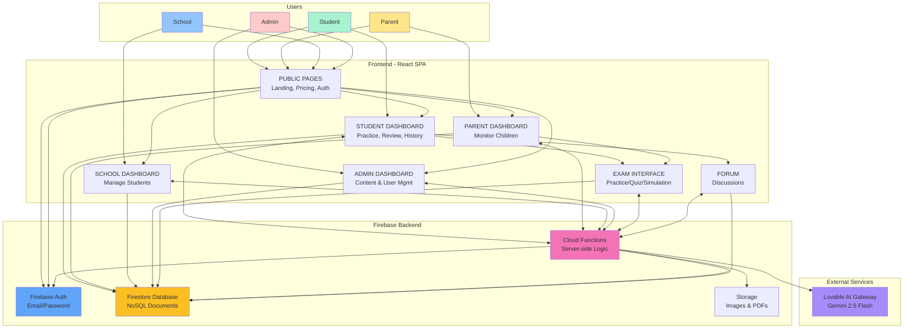

# XamPreps System Architecture

## Overview

XamPreps is a full-stack web application built with React (frontend) and Firebase (backend-as-a-service). The system serves four user roles—Student, Parent, School, and Admin—each with distinct interfaces and capabilities.

## Architecture Diagram



## Component Details

### Frontend Applications

| Component         | Path                                                       | Technology       | Purpose                                 |
| ----------------- | ---------------------------------------------------------- | ---------------- | --------------------------------------- |
| Public Pages      | `src/pages/LandingPage.tsx`, `PricingPage.tsx`, `Auth.tsx` | React + Vite     | Marketing, pricing, authentication      |
| Student Dashboard | `src/pages/dashboards/StudentDashboard.tsx`                | React + Tailwind | Practice, review, progress tracking     |
| Parent Dashboard  | `src/pages/dashboards/ParentDashboard.tsx`                 | React + Tailwind | Monitor linked children                 |
| School Dashboard  | `src/pages/dashboards/SchoolDashboard.tsx`                 | React + Tailwind | Manage student cohorts                  |
| Admin Dashboard   | `src/pages/dashboards/AdminDashboard.tsx`                  | React + Tailwind | Content & user management               |
| Exam Interface    | `src/pages/ExamTakingPage.tsx`                             | React + Tailwind | Three modes: practice, quiz, simulation |
| Forum             | `src/pages/ForumPage.tsx`                                  | React + Tailwind | Community discussions                   |

### Backend Services (Firebase Cloud Functions)

Located in `functions/index.js` (2,450 lines):

| Function Category    | Key Functions                                                                                                                                                                                                   |
| -------------------- | --------------------------------------------------------------------------------------------------------------------------------------------------------------------------------------------------------------- |
| **Authentication**   | `whoAmI` - returns user info and claims                                                                                                                                                                         |
| **Account Linking**  | `generateLinkCode`, `redeemLinkCode`, `sendLinkRequest`, `respondToLinkRequest`, `listLinkedAccounts`, `unlinkAccount`                                                                                          |
| **Exam Operations**  | `submitExamAttempt`, `getExamAttempt`, `listExamHistory`, `getLatestExamAttemptId`, `listExams`, `getExamContent`                                                                                               |
| **Review System**    | `listReviewDueQuestions`, `submitReviewAnswer`                                                                                                                                                                  |
| **Dashboard Data**   | `listStudentDashboardSummary`, `listLinkedStudentsOverview`, `adminDashboardSummary`                                                                                                                            |
| **Forum Management** | `listForumCategories`, `listForumPosts`, `listForumReplies`, `createForumPost`, `createForumReply`, `upsertForumCategory`, `deleteForumCategory`, `setForumPostPinned`, `setForumPostLocked`, `deleteForumPost` |
| **Notifications**    | `listNotifications`, `markNotificationRead`, `markAllNotificationsRead`, `deleteNotification`                                                                                                                   |
| **AI Services**      | `aiExplanations`, `studyAssistant`                                                                                                                                                                              |
| **Admin Operations** | `adminListExams`, `adminUpsertExam`, `adminDuplicateExam`, `adminListExamQuestionsPreview`, `adminListExamQuestionsFull`, `adminSaveExamQuestions`, `adminBulkImportQuestions`, `adminSetQuestionImageUrls`     |
| **Utilities**        | `healthCheck`                                                                                                                                                                                                   |

### Data Storage

| Service          | Purpose             | Usage                                                      |
| ---------------- | ------------------- | ---------------------------------------------------------- |
| Firestore        | Primary database    | All application data (users, exams, attempts, forum, etc.) |
| Firebase Auth    | User authentication | Email/password sign-up and login                           |
| Firebase Storage | File storage        | Question images, PDF explanations                          |

### External Integrations

| Service            | Purpose                             | Configuration                                                       |
| ------------------ | ----------------------------------- | ------------------------------------------------------------------- |
| Lovable AI Gateway | AI explanations and study assistant | `LOVABLE_API_KEY` environment variable, uses Gemini 2.5 Flash model |

## Data Flow Patterns

### 1. Student Taking an Exam

```
Student → ExamTakingPage → getExamContentFirebase() → Cloud Function: getExamContent
    → Firestore: exams, questions, question_parts
    → Returns exam + questions with parts
Student → Answers questions → submitExamAttemptFirebase() → Cloud Function: submitExamAttempt
    → Firestore: exam_attempts (write), question_history (write), user_progress (update)
    → Returns: attemptId, xpEarned, newStreak
```

### 2. Parent Linking Child Account

```
Parent → GenerateLinkCodeDialog → generateLinkCodeFirebase() → Cloud Function: generateLinkCode
    → Firestore: link_codes (write with 24hr expiry)
    → Returns: 8-character code
Student → RedeemLinkCodeDialog → redeemLinkCodeFirebase() → Cloud Function: redeemLinkCode
    → Firestore: link_codes (update usedBy), linked_accounts (write)
    → Returns: link status
```

### 3. Admin Managing Content

```
Admin → AdminDashboard → QuestionEditor → adminListExamQuestionsFullFirebase()
    → Cloud Function: adminListExamQuestionsFull
    → Firestore: questions, question_parts (read with ordering)
Admin → Edits questions → adminSaveExamQuestionsFirebase()
    → Cloud Function: adminSaveExamQuestions
    → Firestore: questions (delete old, write new), question_parts (delete old, write new), exams (update count)
```

## Security Model

### Authentication

- Firebase Auth handles email/password authentication
- Custom app roles stored in `user_roles` collection (student/parent/school/admin)
- Role checked via `getIdTokenResult()` claims (if set) or direct Firestore read

### Authorization

- Protected routes via `ProtectedRoute` component checking role
- Cloud Functions validate authentication and check roles
- Firestore security rules: **Currently open** (expire April 8, 2026) - NEEDS IMPLEMENTATION

### Known Security Gaps

1. Firestore rules allow all access until expiry date
2. No custom claims set in Firebase Auth (roles only in Firestore)
3. Client-side role checking can be bypassed

## Known Gaps / Unclear Areas

### Incomplete Features

1. **Payment Processing** - UI exists but no actual payment gateway integration
2. **Subscription Management** - `subscriptions` collection queried but never written
3. **Achievement System** - Achievements displayed but never awarded
4. **Analytics Dashboard** - Admin analytics tab shows "coming soon"

### Missing Connections

1. **Push Notifications** - Notification CRUD exists but no push notification infrastructure
2. **Email Notifications** - No email sending for account linking, password reset, etc.
3. **Content Migration** - No clear process for populating real exam content

### Architecture Concerns

1. **Dual Naming Convention** - All fields written in both camelCase and snake_case (e.g., `userId` AND `user_id`)
2. **No Rate Limiting** - Cloud Functions have `maxInstances: 10` but no per-user rate limiting
3. **AI Dependency** - AI explanations depend on external gateway with no fallback
4. **Missing Indexes** - `firestore.indexes.json` is empty; queries requiring composite indexes will fail

### Files Referenced

- `src/App.tsx` - Main routing
- `src/contexts/AuthContext.tsx` - Authentication state
- `src/components/ProtectedRoute.tsx` - Route protection
- `functions/index.js` - All Cloud Functions
- `src/integrations/firebase/client.ts` - Firebase initialization
- `firestore.rules` - Security rules (incomplete)
- `firebase.json` - Firebase configuration
