# XamPreps User Flow Map

## Overview

This document maps the major user flows through the XamPreps platform, showing entry points, screens, actions, backend updates, and potential failure points.

## 1. Authentication Flow

### 1.1 Sign Up (Student)

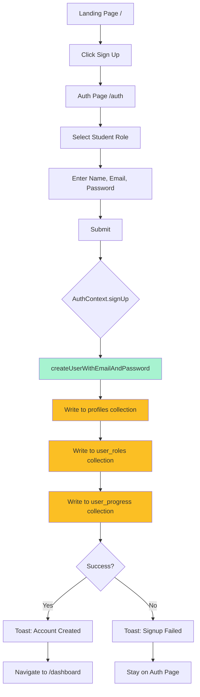

**Entry Point:** `/` or `/auth`  
**Screens:** Landing Page → Auth Page  
**Backend Updates:**

- `profiles/{uid}` - name, email, created_at, updated_at
- `user_roles/{uid}` - role: 'student', updated_at
- `user_progress/{uid}` - xp: 0, streak: 0, updated_at

**Failure Points:**

- Email already in use → Firebase error
- Weak password → Firebase error
- Network failure → Toast error, user stays on page

**Files:** `src/pages/Auth.tsx`, `src/contexts/AuthContext.tsx`

### 1.2 Sign Up (Parent/School)

Same flow as student but with role selection for parent or school.

### 1.3 Sign In

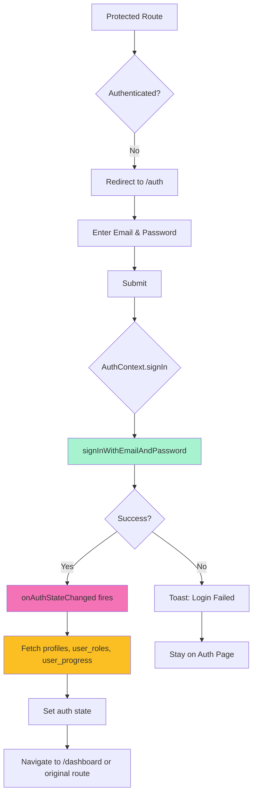

**Entry Point:** Any protected route, `/auth`  
**Screens:** Auth Page  
**Backend Reads:**

- `profiles/{uid}`
- `user_roles/{uid}`
- `user_progress/{uid}`

**Failure Points:**

- Invalid credentials → Firebase error
- User not found → Firebase error
- Network failure → Toast error

**Files:** `src/contexts/AuthContext.tsx`, `src/components/ProtectedRoute.tsx`

## 2. Student Core Flows

### 2.1 Take Practice Exam

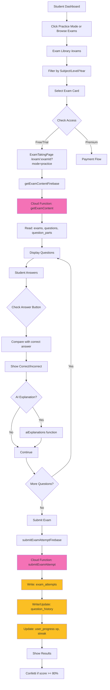

**Entry Point:** Student Dashboard → Quick Action or Exam Library  
**Screens:** Dashboard → Exam Library → Exam Taking → Results  
**Backend Operations:**

- **Read:** `exams/{id}`, `questions` (where examId=), `question_parts` (where questionId=)
- **Write:** `exam_attempts/{newId}`, `question_history/{uid_questionPartId}`, `user_progress/{uid}`

**Failure Points:**

- Exam not found → Navigate back to library
- No questions in exam → Show "no questions" message
- Submit fails → Retry or save locally
- AI service unavailable → Fallback to static explanation

**Files:** `src/pages/ExamTakingPage.tsx`, `src/pages/ExamListPage.tsx`, `src/integrations/firebase/exams.ts`, `functions/index.js`

### 2.2 Take Timed Simulation Exam

Same as practice but with:

- Timer displayed and counting down
- Auto-submit when time expires
- No "Check Answer" button during exam
- All answers checked at submission

**Additional State:** `timeLeft` countdown timer

### 2.3 Quiz Mode

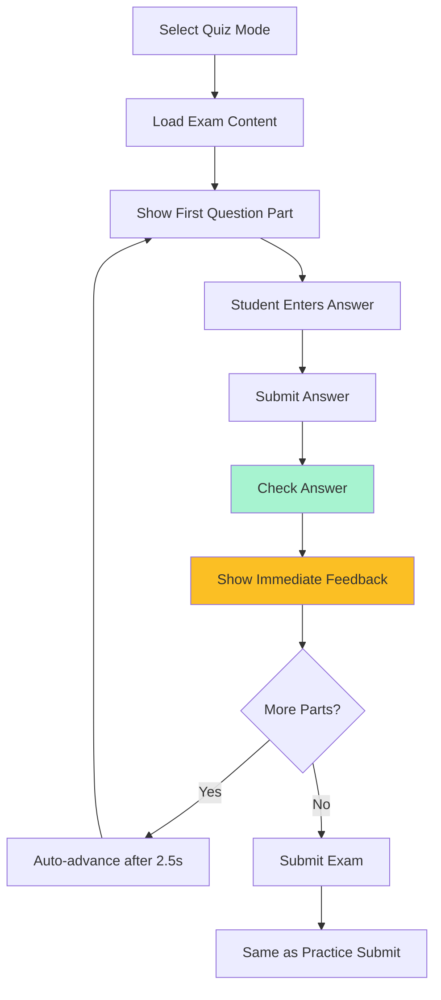

**Key Difference:** One question at a time with immediate feedback and auto-advance.

### 2.4 Review Session (Spaced Repetition)

```mermaid
flowchart TD
    A[Click Review on Dashboard] --> B[/review]
    B --> C[listReviewDueQuestionsFirebase]
    C --> D[Cloud Function: listReviewDueQuestions]
    D --> E[Query: question_history where nextReview <= now]
    E --> F[For each: fetch question, part, exam]
    F --> G[Display Review Items]
    G --> H{No Items?}
    H -->|Yes| I[Show All Caught Up message]
    H -->|No| J[Show First Question]
    J --> K[Student Re-answers]
    K --> L[Submit Answer]
    L --> M[Check Answer]
    M --> N[Calculate new streak & next review]
    N --> O[submitReviewAnswerFirebase]
    O --> P[Update question_history]
    P --> Q{More Items?}
    Q -->|Yes| R[Show Next]
    R --> J
    Q -->|No| S[Show Session Summary]

    style D fill:#f472b6
    style E fill:#fbbf24
    style O fill:#f472b6
    style P fill:#fbbf24
```

**Entry Point:** Dashboard → Review button or `/review`  
**Screens:** Review Session  
**Backend Operations:**

- **Read:** `question_history` (where userId= AND nextReview <= now), then join with `question_parts`, `questions`, `exams`
- **Write:** `question_history/{id}` - update isCorrect, streak, nextReview, lastAttempt

**Spaced Repetition Algorithm (SM-2 Variant):**
| Streak | Next Review Interval |
|--------|---------------------|
| 0 (incorrect) | 1 hour |
| 1 | 24 hours (1 day) |
| 2 | 72 hours (3 days) |
| 3 | 168 hours (7 days) |
| 4 | 336 hours (14 days) |
| 5 | 720 hours (30 days) |
| 6+ | min(streak \* 168, 2160) hours |

**Files:** `src/pages/ReviewSessionPage.tsx`, `src/integrations/firebase/content.ts`

## 3. Parent Flows

### 3.1 Link Child Account (Code-Based)

```mermaid
flowchart TD
    A[Parent Dashboard] --> B[Click Generate Link Code]
    B --> C[GenerateLinkCodeDialog]
    C --> D[generateLinkCodeFirebase]
    D --> E[Cloud Function: generateLinkCode]
    E --> F[Generate 8-char code]
    F --> G[Check uniqueness (5 attempts)]
    G --> H[Write to link_codes with 24hr expiry]
    H --> I[Display code to parent]
    I --> J[Parent shares code with child]

    style E fill:#f472b6
    style H fill:#fbbf24
```

**Entry Point:** Parent Dashboard → Generate Link Code  
**Backend Operations:**

- **Write:** `link_codes/{newId}` - code, creatorId, creatorType: 'parent', expiresAt (24hrs), usedBy: null

**Failure Points:**

- Failed to generate unique code after 5 attempts → Error toast

### 3.2 Student Redeems Link Code

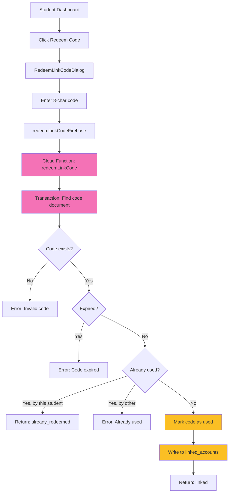

**Entry Point:** Student Dashboard → Redeem Code  
**Backend Operations:**

- **Read/Write (Transaction):** `link_codes/{id}` - update usedBy, usedAt
- **Write:** `linked_accounts/{parentOrSchoolId_studentId}` - parentOrSchoolId, studentId, linkedAt

**Failure Points:**

- Invalid code → Error message
- Expired code → Error message
- Already used by another student → Error message

**Files:** `src/components/modals/RedeemLinkCodeDialog.tsx`, `functions/index.js`

### 3.3 View Child Progress

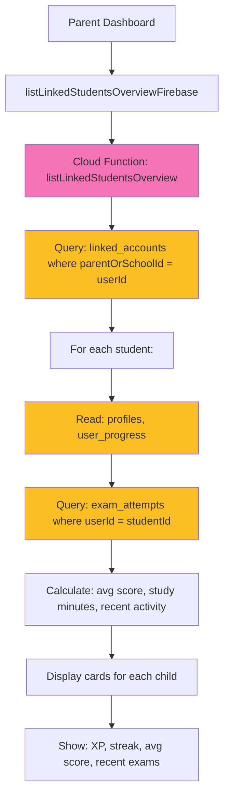

**Entry Point:** Parent Dashboard  
**Backend Operations:**

- **Read:** `linked_accounts` (where parentOrSchoolId=), then for each: `profiles`, `user_progress`, `exam_attempts`

**Files:** `src/pages/dashboards/ParentDashboard.tsx`, `functions/index.js`

## 4. Admin Flows

### 4.1 Create/Edit Exam

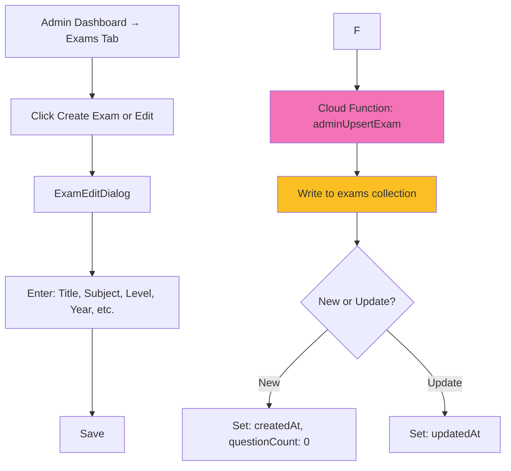

**Entry Point:** Admin Dashboard → Exams Tab → Create/Edit  
**Backend Operations:**

- **Write:** `exams/{id}` - title, subject, level, year, type, difficulty, timeLimit, isFree, description, topic, explanationPdfUrl

### 4.2 Edit Questions

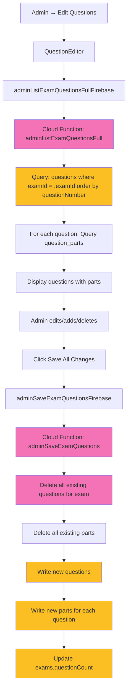

**Entry Point:** Admin Dashboard → Exams → Edit Questions  
**Backend Operations:**

- **Read:** `questions` (where examId=), `question_parts` (where questionId=)
- **Write (Delete all, then create):** `questions`, `question_parts`, update `exams.questionCount`

**Risk:** Delete-then-create pattern means if write fails mid-way, exam has no questions.

**Files:** `src/components/admin/QuestionEditor.tsx`, `functions/index.js`

### 4.3 Forum Moderation

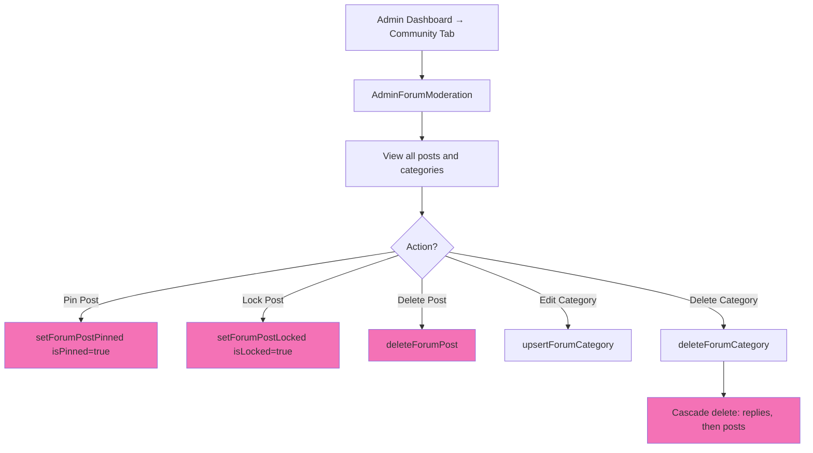

**Entry Point:** Admin Dashboard → Community Tab  
**Backend Operations:**

- **Update:** `forum_posts/{id}` - isPinned, isLocked
- **Delete (cascade):** `forum_replies` → `forum_posts` → `forum_categories`

## 5. Payment Flow (INCOMPLETE)

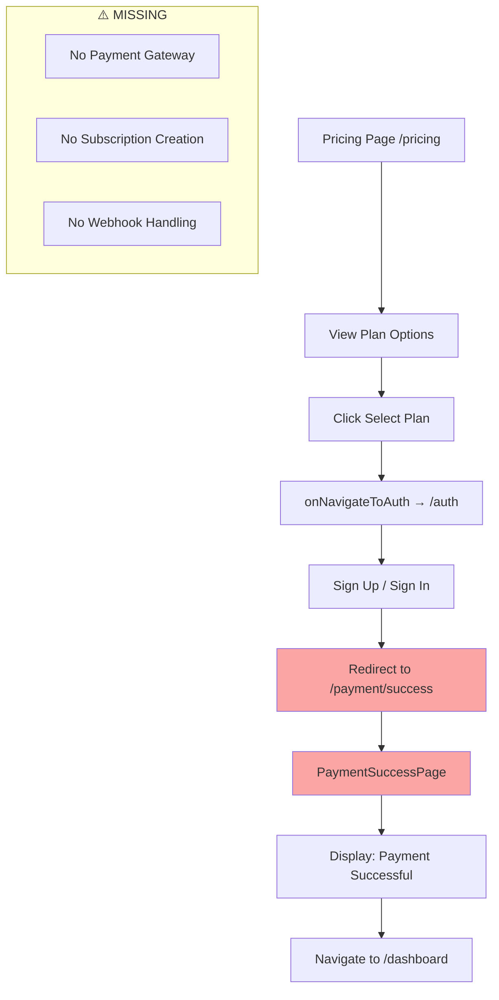

**Entry Point:** `/pricing`  
**Screens:** Pricing Page → Auth → Payment Success  
**Problem:** No actual payment processing exists. The flow goes directly from auth to success page.

**Missing Components:**

- Payment gateway integration (Stripe, PayPal, etc.)
- Subscription creation in Firestore
- Webhook handling for payment confirmation
- Receipt generation

**Files:** `src/pages/PricingPage.tsx`, `src/pages/PaymentSuccessPage.tsx`, `src/components/pricing/`

## 6. Forum Flow

### 6.1 Create Forum Post (Parent/Admin Only)

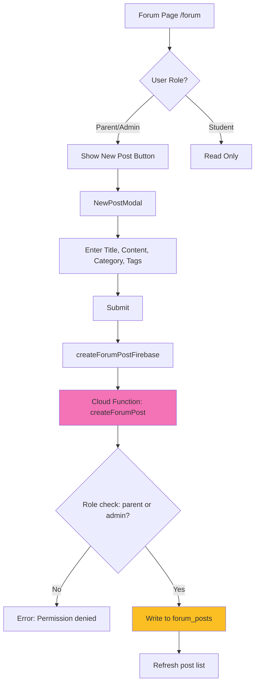

**Entry Point:** `/forum`  
**Permission Check:** Only `parent` or `admin` roles can create posts  
**Backend Operations:**

- **Write:** `forum_posts/{newId}` - title, content, categoryId, authorId, isPinned: false, isLocked: false, tags

### 6.2 Reply to Post

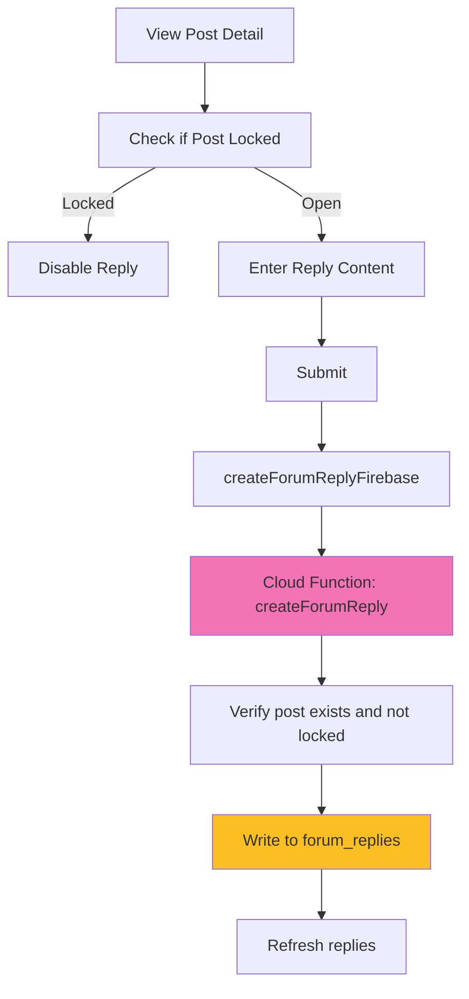

**Backend Operations:**

- **Read:** `forum_posts/{postId}` - check isLocked
- **Write:** `forum_replies/{newId}` - postId, authorId, content

## 7. Known Gaps / Broken Flows

### 7.1 Incomplete Features

| Flow                    | Status  | Issue                                                  |
| ----------------------- | ------- | ------------------------------------------------------ |
| Payment Processing      | Broken  | No payment gateway; success page shown without payment |
| Subscription Management | Missing | `subscriptions` collection never written to            |
| Achievement Awarding    | Missing | Achievements displayed but never earned                |
| Notification Generation | Missing | Notifications read/managed but never created           |
| Email Notifications     | Missing | No email sending for any events                        |
| Password Reset          | Missing | No password reset flow                                 |
| Profile Editing         | Partial | Basic fields editable but not all                      |

### 7.2 Broken Paths

| Flow                   | Entry Point                     | Problem                          |
| ---------------------- | ------------------------------- | -------------------------------- |
| Payment → Subscription | `/pricing`                      | No actual subscription created   |
| Free Trial             | `useExamAccess` hook            | No clear UI to claim free trial  |
| Analytics              | Admin Dashboard → Analytics tab | Shows "coming soon" placeholders |

### 7.3 Missing UI for Backend Functions

| Cloud Function              | Purpose                    | Missing UI                                          |
| --------------------------- | -------------------------- | --------------------------------------------------- |
| `listNotifications`         | Get user notifications     | Notification bell exists but no notification center |
| `adminSetQuestionImageUrls` | Batch update image URLs    | No dedicated UI, only via QuestionEditor            |
| `adminBulkImportQuestions`  | Import questions from data | UI exists but may be incomplete                     |

### 7.4 Edge Cases Not Handled

1. **User deletes account** - No cascade deletion of related data
2. **Exam deleted while student is taking it** - No error handling
3. **Network loss during exam** - Answers not saved locally
4. **Simultaneous edits by multiple admins** - Last write wins, no conflict resolution
5. **Student encounters same question in different exams** - `question_history` overwrites due to document ID collision

## Files Referenced

### Frontend Pages

- `src/pages/Auth.tsx` - Authentication
- `src/pages/dashboards/StudentDashboard.tsx` - Student home
- `src/pages/dashboards/ParentDashboard.tsx` - Parent home
- `src/pages/dashboards/AdminDashboard.tsx` - Admin home
- `src/pages/ExamTakingPage.tsx` - Exam interface
- `src/pages/ReviewSessionPage.tsx` - Spaced repetition
- `src/pages/ForumPage.tsx` - Community forum
- `src/pages/PricingPage.tsx` - Pricing plans
- `src/pages/PaymentSuccessPage.tsx` - Payment confirmation

### Components

- `src/components/ProtectedRoute.tsx` - Route protection
- `src/components/modals/RedeemLinkCodeDialog.tsx` - Code redemption
- `src/components/admin/QuestionEditor.tsx` - Question management

### Backend

- `functions/index.js` - All Cloud Functions (2,450 lines)

### Context/Hooks

- `src/contexts/AuthContext.tsx` - Authentication state
- `src/hooks/useExamAccess.ts` - Access control logic
